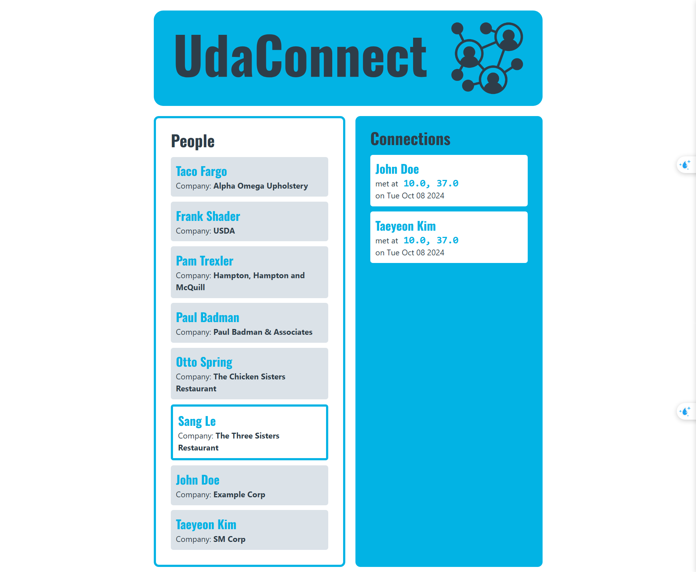

# UdaConnect
## Overview
### Background
Conferences and conventions are hotspots for making connections. Professionals in attendance often share the same interests and can make valuable business and personal connections with one another. At the same time, these events draw a large crowd and it's often hard to make these connections in the midst of all of these events' excitement and energy. To help attendees make connections, we are building the infrastructure for a service that can inform attendees if they have attended the same booths and presentations at an event.

### Technologies
* [Flask](https://flask.palletsprojects.com/en/1.1.x/) - API webserver
* [SQLAlchemy](https://www.sqlalchemy.org/) - Database ORM
* [PostgreSQL](https://www.postgresql.org/) - Relational database
* [PostGIS](https://postgis.net/) - Spatial plug-in for PostgreSQL enabling geographic queries
* [K3s](https://k3s.io/) - Lightweight distribution of K8s to easily develop against a local cluster

## Architecture

### Architecture Decision


- **Frontend** provides UI for user interaction.
- **Person Service** is RESTFul API service which keep user information.
- **Connection Service** is RESTful API service which manage connections via geolocation.
- **Location Service** recieves user coordinates sent by mobiles devices. This communication is established using gRPC. It works as a producer which send data to Kafka broker for downstream processing.
- **Location Consumer Service** consumes data from Kafka broker and then save data to database.
- The deployment process uses Kubernetes resources (Deployment) which can scale to handle large volumes of location data being ingested.

### Configs and Secrets
In `deployment/db-secret.yaml`, the secret variable is `d293aW1zb3NlY3VyZQ==`. The value is simply encoded and not encrypted -- this is ***not*** secure! Anyone can decode it to see what it is.
```bash
# Decodes the value into plaintext
echo "d293aW1zb3NlY3VyZQ==" | base64 -d

# Encodes the value to base64 encoding. K8s expects your secrets passed in with base64
echo "hotdogsfordinner" | base64
```
This is okay for development against an exclusively local environment and we want to keep the setup simple so that you can focus on the project tasks. However, in practice we should not commit our code with secret values into our repository. A CI/CD pipeline can help prevent that.

### PostgreSQL Database
The database uses a plug-in named PostGIS that supports geographic queries. It introduces `GEOMETRY` types and functions that we leverage to calculate distance between `ST_POINT`'s which represent latitude and longitude.

_You may find it helpful to be able to connect to the database_. In general, most of the database complexity is abstracted from you. The Docker container in the starter should be configured with PostGIS. Seed scripts are provided to set up the database table and some rows.

### Database Connection
While the Kubernetes service for `postgres` is running (you can use `kubectl get services` to check), you can expose the service to connect locally:
```bash
kubectl port-forward svc/postgres 5432:5432
```
This will enable you to connect to the database at `localhost`. You should then be able to connect to `postgresql://localhost:5432/geoconnections`. This is assuming you use the built-in values in the deployment config map.


## Running the app
The project has been set up such that you should be able to have the project up and running with Kubernetes.
To run the application, you will need a K8s cluster running locally and to interface with it via `kubectl`.

### Kafka

- Follow the instruction at `./modules/kafka/README.md` to install Kafka

### Person Service

- Go to `/modules/person` folder and run:
```
kubectl apply -f deployment/
```

- After all pods are running, run the script to create **person** database:
```
/scripts/run_db_command.sh <POSTGRES_PERSON_DB_POD_NAME>
```

### Connaction Service

- Go to `/modules/connection` folder and run:
```
kubectl apply -f deployment/
```

- After all pods are running, run the script to create **location** database:
```
/scripts/run_db_command.sh <POSTGRES_LOCATION_DB_POD_NAME>
```

### Location Service

- This service needs to authenticate with Kafka to publish event. It requires `username` and `password`. Check `./modules/kafka/README.md` to get password of Kafka.

- Go to `/modules/location` folder and run:
```
kubectl apply -f deployment/
```

### Location Consumer Service

- This service needs to authenticate with Kafka to publish event. It requires `username` and `password`. Check `./modules/kafka/README.md` to get password of Kafka.

- Go to `/modules/location-consumer` folder and run:
```
kubectl apply -f deployment/
```


### Frontend Service

- Go to `/modules/frontend` folder and run:
```
kubectl apply -f deployment/
```



### Verifying it Works
Once the project is up and running, you should be able to see 3 deployments and 3 services in Kubernetes:
`kubectl get pods` and `kubectl get services` - should both return `udaconnect-app`, `udaconnect-api`, and `postgres`


These pages should also load on your web browser:
* `http://localhost:30000/` - Frontend ReactJS Application
* `http://localhost:30001/` - Person Service
* `http://localhost:30002/` - Connection Service
* `localhost:30003` - Location gRPC Service
